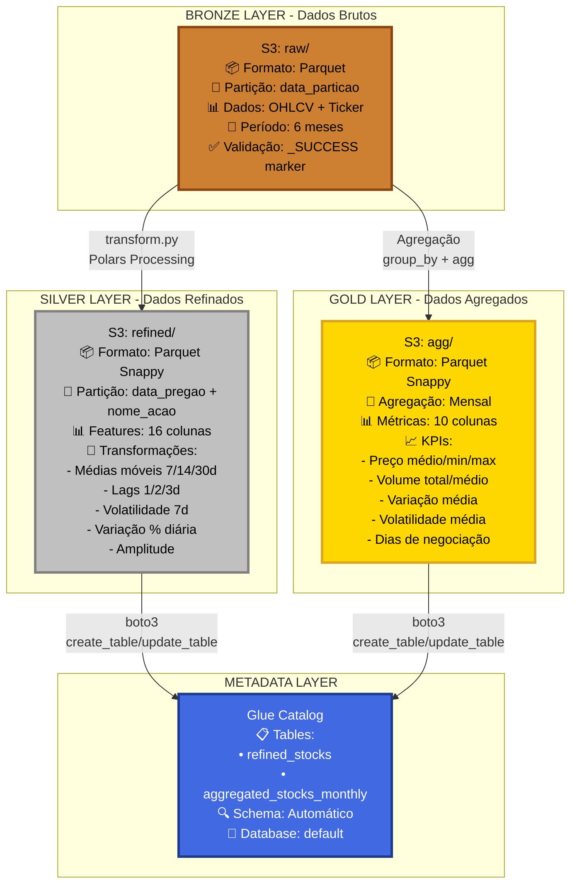
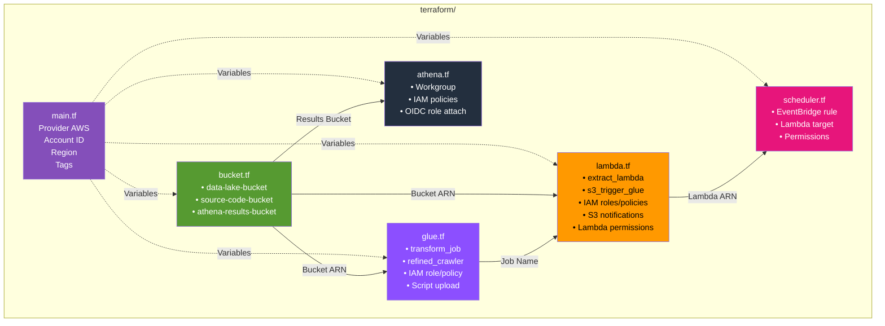
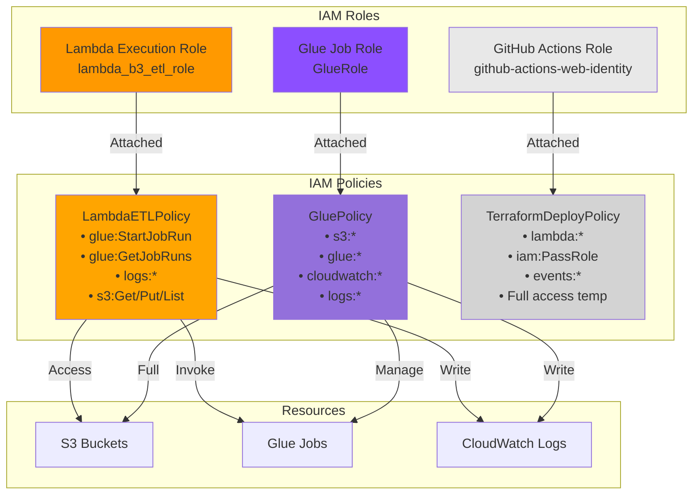

# 🏗️ Arquitetura do Pipeline B3 - Tech Challenge 2

## Visão Geral do Fluxo

```mermaid
graph TB
    subgraph "1️⃣ AGENDAMENTO"
        EB[EventBridge Scheduler<br/>cron: 22:00 UTC / 19:00 BRT<br/>Execução Diária]
    end

    subgraph "2️⃣ EXTRAÇÃO D-1"
        LE[Lambda Extract<br/>extract.py<br/>Python 3.10<br/>300s timeout]
        YF[Yahoo Finance API<br/>yfinance<br/>Dados de D-1]
    end

    subgraph "3️⃣ ARMAZENAMENTO RAW"
        S3R[S3 Bucket - RAW<br/>raw/YYYY-MM-DD/data.parquet<br/>Formato Hive Partitioning]
        MARKER[Arquivo _SUCCESS<br/>Trigger Marker]
    end

    subgraph "4️⃣ ORQUESTRAÇÃO"
        S3N[S3 Event Notification<br/>ObjectCreated: _SUCCESS<br/>filter_suffix]
        LT[Lambda Trigger<br/>trigger_glue.py<br/>Verifica job ativo]
    end

    subgraph "5️⃣ TRANSFORMAÇÃO"
        GJ[AWS Glue Job<br/>transform.py<br/>Polars + Python<br/>2x G.1X workers]
        FE[Feature Engineering<br/>- Médias Móveis (7/14/30d)<br/>- Lags (1d/2d/3d)<br/>- Volatilidade 7d<br/>- Variação % dia]
        AGG[Agregações Mensais<br/>- Preço médio/min/max<br/>- Volume total/médio<br/>- Dias negociação]
    end

    subgraph "6️⃣ ARMAZENAMENTO PROCESSADO"
        S3REF[S3 Bucket - REFINED<br/>refined/data_pregao=YYYY-MM-DD/<br/>data.parquet<br/>Hive Partitioning]
        S3AGG[S3 Bucket - AGG<br/>agg/mes_referencia=YYYY-MM-DD/<br/>data.parquet<br/>Hive Partitioning]
    end

    subgraph "7️⃣ CATALOGAÇÃO AUTOMÁTICA"
        GC[Glue Catalog<br/>Database: default<br/>Via boto3 + Athena]
        T1[Table: refined_stocks<br/>Partição: data_pregao]
        T2[Table: aggregated_stocks_monthly<br/>Partição: mes_referencia]
        MSCK[MSCK REPAIR TABLE<br/>Descobre partições<br/>automaticamente]
    end

    subgraph "8️⃣ CONSULTA"
        ATH[Amazon Athena<br/>Workgroup: etl_workgroup<br/>SQL Interactive Analytics]
        SQL[Queries SQL<br/>Partições automáticas]
    end

    EB -->|Invoca diariamente| LE
    LE -->|Extrai D-1| YF
    YF -->|Retorna OHLCV| LE
    LE -->|Salva Parquet Hive| S3R
    S3R -->|Cria marker| MARKER
    MARKER -->|Dispara evento S3| S3N
    S3N -->|Invoca| LT
    LT -->|glue.start_job_run| GJ
    GJ -->|Transforma| FE
    FE -->|Agrega| AGG
    AGG -->|Salva refined Hive| S3REF
    AGG -->|Salva agg Hive| S3AGG
    GJ -->|Cataloga boto3| GC
    GC -->|Cria/atualiza| T1
    GC -->|Cria/atualiza| T2
    GJ -->|Executa via Athena| MSCK
    MSCK -->|Descobre partições| GC
    GC -->|Metadata| ATH
    S3REF -->|Leitura| ATH
    S3AGG -->|Leitura| ATH
    ATH -->|Executa| SQL

    style EB fill:#FF9900
    style LE fill:#FF9900
    style LT fill:#FF9900
    style S3R fill:#569A31
    style S3REF fill:#569A31
    style S3AGG fill:#569A31
    style GJ fill:#8C4FFF
    style GC fill:#8C4FFF
    style CRAW fill:#8C4FFF
    style ATH fill:#232F3E
    style YF fill:#E8E8E8
```

---

## Arquitetura Detalhada AWS

```mermaid
graph LR
    subgraph Internet
        YF[Yahoo Finance<br/>B3 Stock Data<br/>ITUB4, BBDC4, BBAS3]
    end

    subgraph AWS Cloud
        subgraph Compute
            LE[Lambda Extract<br/>300s timeout<br/>Python 3.10<br/>Layer: AWSSDKPandas]
            LT[Lambda Trigger<br/>60s timeout<br/>Python 3.10]
            GJ[Glue Job<br/>transform_job<br/>2x G.1X workers<br/>Polars + yfinance]
            CRAW[Glue Crawler<br/>refined_crawler]
        end

        subgraph Storage
            S3DL[(S3 Data Lake<br/>account-id-data-lake-bucket)]
            S3SC[(S3 Source Code<br/>account-id-glue-source-code-bucket)]
            S3ATH[(S3 Athena Results<br/>account-id-athena-results-bucket)]
        end

        subgraph Catalog
            GLUECAT[Glue Data Catalog<br/>Database: default<br/>Tables: 2]
        end

        subgraph Analytics
            ATH[Athena<br/>Workgroup: etl_workgroup<br/>SQL Engine]
        end

        subgraph Orchestration
            EB[EventBridge<br/>Cron Rule<br/>22:00 UTC daily]
            S3EVENT[S3 Event<br/>Notification]
        end

        subgraph IAM
            ROLELAMBDA[Lambda Exec Role<br/>S3 + Glue + Logs]
            ROLEGLUE[Glue Job Role<br/>S3 + Glue + Logs]
        end
    end

    YF -.->|HTTPS| LE
    EB -->|Trigger| LE
    LE -->|Write| S3DL
    S3DL -->|Event: _SUCCESS| S3EVENT
    S3EVENT -->|Invoke| LT
    LT -->|StartJobRun| GJ
    GJ -->|Read script| S3SC
    GJ -->|Read raw| S3DL
    GJ -->|Write refined/agg| S3DL
    GJ -->|Create/Update Tables| GLUECAT
    CRAW -->|Scan| S3DL
    CRAW -->|Update| GLUECAT
    ATH -->|Query metadata| GLUECAT
    ATH -->|Read data| S3DL
    ATH -->|Write results| S3ATH
    LE -.->|Assume| ROLELAMBDA
    LT -.->|Assume| ROLELAMBDA
    GJ -.->|Assume| ROLEGLUE

    style YF fill:#E8E8E8,stroke:#333
    style LE fill:#FF9900,stroke:#333,stroke-width:2px
    style LT fill:#FF9900,stroke:#333,stroke-width:2px
    style GJ fill:#8C4FFF,stroke:#333,stroke-width:2px
    style CRAW fill:#8C4FFF,stroke:#333,stroke-width:2px
    style S3DL fill:#569A31,stroke:#333,stroke-width:2px
    style S3SC fill:#569A31,stroke:#333
    style S3ATH fill:#569A31,stroke:#333
    style GLUECAT fill:#8C4FFF,stroke:#333,stroke-width:2px
    style ATH fill:#232F3E,stroke:#333,stroke-width:2px
    style EB fill:#E7157B,stroke:#333
    style S3EVENT fill:#E7157B,stroke:#333
```



---

## Fluxo de Dados - Camadas



---

## Pipeline End-to-End - Timeline

```mermaid
gantt
    title Pipeline Diário B3 - Execução Típica
    dateFormat HH:mm
    axisFormat %H:%M

    section Agendamento
    EventBridge Trigger           :milestone, m1, 22:00, 0m

    section Extração
    Lambda Extract Inicia         :e1, 22:00, 1m
    Download Yahoo Finance D-1    :e2, after e1, 3m
    Processamento Local           :e3, after e2, 1m
    Salvamento Parquet S3 Hive    :e4, after e3, 2m
    Criação _SUCCESS marker       :milestone, m2, after e4, 0m

    section Orquestração
    S3 Event Notification         :o1, after e4, 1m
    Lambda Trigger Glue           :o2, after o1, 1m
    Verifica Job Ativo            :o3, after o2, 1m

    section Transformação
    Glue Job Inicia               :t1, after o3, 1m
    Leitura Raw Data S3           :t2, after t1, 2m
    Feature Engineering           :t3, after t2, 4m
    Agregações Mensais            :t4, after t3, 2m
    Salvamento Refined Hive       :t5, after t4, 2m
    Salvamento Agg Hive           :t6, after t5, 1m
    Catalogação Glue Catalog      :t7, after t6, 1m
    MSCK REPAIR TABLE             :t8, after t7, 2m
    Glue Job Finaliza             :milestone, m3, after t8, 0m

    section Disponibilização
    Dados Prontos Athena          :milestone, m4, after t7, 0m
```



---

## Estrutura de Diretórios S3 (Formato Hive)

```
📁 818392673747-data-lake-bucket/
│
├── 📁 raw/                                    (BRONZE LAYER)
│   ├── 📁 2026-01-14/                        (Data = D-1)
│   │   └── 📄 data.parquet                   (Dados de D-1)
│   ├── 📁 2026-01-15/
│   │   └── 📄 data.parquet
│   └── 📄 _SUCCESS                           (Trigger marker)
│
├── 📁 refined/                                (SILVER LAYER)
│   ├── 📁 data_pregao=2026-01-14/           (Hive Partitioning)
│   │   └── 📄 data.parquet                   (Todas as 3 ações)
│   ├── 📁 data_pregao=2026-01-15/
│   │   └── 📄 data.parquet
│   └── ... (uma partição por dia)
│
└── 📁 agg/                                    (GOLD LAYER)
    ├── 📁 mes_referencia=2025-07-01/        (Hive Partitioning)
    │   └── 📄 data.parquet                   (Agregação mensal - 3 ações)
    ├── 📁 mes_referencia=2025-08-01/
    │   └── 📄 data.parquet
    └── ... (uma partição por mês)
```

---

## Schemas de Dados

### 📊 Tabela: `refined_stocks`

| Coluna | Tipo | Descrição | Exemplo |
|--------|------|-----------|---------|
| `data_pregao` | date | Data do pregão | 2025-07-15 |
| `nome_acao` | string | Código da ação | itub4 |
| `abertura` | double | Preço abertura | 28.50 |
| `fechamento` | double | Preço fechamento | 29.10 |
| `max` | double | Preço máximo | 29.50 |
| `min` | double | Preço mínimo | 28.30 |
| `volume_negociado` | bigint | Volume | 15000000 |
| `variacao_pct_dia` | double | Variação % | 2.11 |
| `amplitude_dia` | double | Amplitude | 1.20 |
| `media_movel_7d` | double | MM 7 dias | 28.80 |
| `media_movel_14d` | double | MM 14 dias | 28.60 |
| `media_movel_30d` | double | MM 30 dias | 28.20 |
| `volatilidade_7d` | double | Vol 7 dias | 0.85 |
| `lag_1d` | double | Preço D-1 | 28.70 |
| `lag_2d` | double | Preço D-2 | 28.50 |
| `lag_3d` | double | Preço D-3 | 28.40 |

**Particionamento:** `data_pregao` (string) - Formato Hive

**Catalogação:** Automática via MSCK REPAIR TABLE no Glue Job

---

### 📈 Tabela: `aggregated_stocks_monthly`

| Coluna | Tipo | Descrição | Exemplo |
|--------|------|-----------|---------|
| `nome_acao` | string | Código da ação | itub4 |
| `mes_referencia` | date | Mês/ano | 2025-07-01 |
| `preco_medio_mensal` | double | Média preços | 28.75 |
| `preco_minimo_mensal` | double | Mínimo mês | 27.50 |
| `preco_maximo_mensal` | double | Máximo mês | 30.20 |
| `volume_total_mensal` | bigint | Volume total | 320000000 |
| `volume_medio_diario` | double | Volume médio | 15000000 |
| `variacao_media_diaria_pct` | double | Var média | 1.25 |
| `volatilidade_media_mensal` | double | Vol média | 0.92 |
| `dias_negociacao` | bigint | Dias úteis | 21 |

**Particionamento:** Nenhum (arquivo único)

---

## Componentes de Infraestrutura (Terraform)

### 🗂️ Recursos Provisionados



---

## Stack Tecnológico

### 🐍 Python & Libraries

| Componente | Linguagem/Framework | Versão |
|------------|-------------------|--------|
| Lambda Extract | Python | 3.10 |
| Lambda Trigger | Python | 3.10 |
| Glue Job | Python + PySpark API | 3.x |
| Data Processing | Polars | Latest |
| Data Extraction | yfinance | Latest |
| Data Serialization | PyArrow | Latest |
| AWS SDK | Boto3 | Latest |

### ☁️ AWS Services

| Serviço | Propósito | Configuração |
|---------|-----------|--------------|
| **EventBridge** | Agendamento | Cron diário 22:00 UTC |
| **Lambda** | Compute serverless | 2 functions (extract + trigger) |
| **S3** | Object storage | 3 buckets (data lake + code + results) |
| **Glue** | ETL serverless | 1 job + 1 crawler |
| **Glue Catalog** | Metadata store | Database: default, 2 tables |
| **Athena** | SQL analytics | 1 workgroup |
| **IAM** | Security | 2 roles (Lambda + Glue) |
| **CloudWatch** | Logging & monitoring | Automatic integration |

### 🏗️ Infrastructure

| Ferramenta | Propósito |
|-----------|-----------|
| **Terraform** | Infrastructure as Code |
| **Git** | Version control |
| **GitHub Actions** | CI/CD (via OIDC) |

---

## Segurança & Permissões



---

## Monitoramento & Observabilidade

### 📊 CloudWatch Logs

```
Log Groups criados automaticamente:
├── /aws/lambda/b3_extract_function
├── /aws/lambda/s3_trigger_glue_transform
└── /aws-glue/jobs/transform_job
```

### 🔍 Métricas Rastreadas

| Componente | Métricas |
|-----------|----------|
| **Lambda Extract** | Duration, Memory, Errors, Invocations |
| **Lambda Trigger** | Duration, Errors, Invocations |
| **Glue Job** | ExecutionTime, CPUTime, MemoryUsage, DPU usage |
| **Athena** | DataScanned, QueryExecutionTime, Cost |
| **S3** | Storage size, Request count, Data transfer |

### 📝 Logs Estruturados

Ambos os scripts Python incluem logging detalhado:
- ✅ Status de cada etapa
- 📊 Contagem de registros processados
- ⏱️ Timestamps de execução
- ❌ Stack traces de erros
- 🔍 Diagnósticos de conectividade

---

## Exemplo de Execução End-to-End

### ⏰ 22:00 UTC - EventBridge Trigger
```
EventBridge Rule: daily_b3_etl_trigger
Target: Lambda b3_extract_function
```

### 📥 22:00-22:12 - Extração
```
Lambda: b3_extract_function
Logs:
  ✓ Conectividade OK com Yahoo Finance
  ✓ Baixando ITUB4.SA... 126 registros
  ✓ Baixando BBDC4.SA... 126 registros
  ✓ Baixando BBAS3.SA... 126 registros
  ✓ Total: 378 registros
  ✓ Salvando em /tmp/raw_data com 182 partições
  ✓ Upload para s3://bucket/raw/execution_date=2026-01-14/run_20260114_220530/
  ✓ Marker criado: _SUCCESS
```

### 🚀 22:12-22:13 - Trigger
```
S3 Event → Lambda: s3_trigger_glue_transform
Logs:
  Prefixo detectado: s3://bucket/raw/execution_date=2026-01-14/run_20260114_220530/
  ✓ Nenhum job em execução
  ✓ Glue Job iniciado: jr_abc123xyz
```

### ⚙️ 22:13-22:28 - Transformação
```
Glue Job: transform_job
Logs:
  ✓ Dados carregados: 378 registros
  ✓ Formato WIDE detectado → convertendo para LONG
  ✓ Tickers: ITUB4.SA, BBDC4.SA, BBAS3.SA
  ✓ Features criadas: 16 colunas
  ✓ Agregações: 18 registros mensais
  ✓ Dados refined salvos (particionado)
  ✓ Dados agregados salvos
  ✓ Tabela 'refined_stocks' criada/atualizada
  ✓ Tabela 'aggregated_stocks_monthly' criada/atualizada
  ✅ TRANSFORMAÇÃO CONCLUÍDA
```

### 🔍 22:28+ - Disponível para consulta
```sql
-- Query no Athena agora funciona
SELECT * FROM refined_stocks 
WHERE nome_acao = 'itub4' 
AND data_pregao >= DATE('2025-12-01')
LIMIT 10;

-- Resultado: 10 registros retornados
```

---

## Performance & Custos Estimados

### ⚡ Performance

| Etapa | Duração Típica | Volume |
|-------|---------------|--------|
| Extração | 8-12 min | 378 registros (3 ações x 126 dias úteis) |
| Transformação | 12-15 min | 378 → 546 partições refined + 18 agregados |
| **Total Pipeline** | **~25 min** | Raw → Refined → Catalogado |

### 💰 Custos Estimados (Mensal)

| Serviço | Uso | Custo Aprox (USD) |
|---------|-----|------------------|
| Lambda Extract | 30 invocações x 10min | ~$0.02 |
| Lambda Trigger | 30 invocações x 1min | ~$0.001 |
| Glue Job | 30 execuções x 15min x 2 DPU | ~$4.50 |
| S3 Storage | ~100 MB | ~$0.002 |
| Athena Queries | ~10 GB scanned/mês | ~$0.05 |
| **Total Mensal** | | **~$4.60** |

---

## 🆕 Melhorias Implementadas (v2.0)

### 1. **Extração Incremental (D-1)**
- ✅ **Antes:** Extraía 180 dias (6 meses) a cada execução
- ✅ **Agora:** Extrai apenas dados de D-1 (ontem)
- ✅ **Benefício:** 180x menos dados transferidos, execução mais rápida

### 2. **Dry Run Mode**
- ✅ Lambda aceita `event.dry_run = true` para testes
- ✅ Executa extração completa mas não salva no S3
- ✅ Usado no smoke test do CI/CD para não poluir dados de produção

### 3. **Hive Partitioning**
- ✅ **Formato:** `coluna=valor/` ao invés de apenas `valor/`
- ✅ **Exemplo:** `data_pregao=2026-01-14/` ao invés de `2026-01-14/`
- ✅ **Benefício:** Compatibilidade nativa com Athena/Glue

### 4. **Catalogação Automática via MSCK REPAIR TABLE**
- ✅ Glue Job executa `MSCK REPAIR TABLE` via Athena client
- ✅ Descobre TODAS as partições do S3 automaticamente
- ✅ Fallback para registro manual se MSCK falhar
- ✅ **Benefício:** Sem necessidade de queries manuais no Athena

### 5. **Trigger Inteligente (_SUCCESS)**
- ✅ Lambda Extract cria arquivo `_SUCCESS` após upload completo
- ✅ S3 Event Notification trigga apenas com `filter_suffix = "_SUCCESS"`
- ✅ **Benefício:** Evita triggers prematuros durante upload de múltiplos arquivos

### 6. **Prevenção de Execuções Concorrentes**
- ✅ Lambda Trigger verifica se já existe Glue Job rodando
- ✅ Retorna 202 (Accepted) se job já ativo
- ✅ **Benefício:** Evita sobrecarga e custos duplicados

---

## Conclusão

Esta arquitetura implementa um pipeline de dados **robusto, escalável e serverless** para análise de ações da B3, utilizando:

✅ **Event-driven architecture** para orquestração eficiente  
✅ **Camadas Bronze/Silver/Gold** para organização de dados  
✅ **Hive Partitioning** para compatibilidade nativa com Athena  
✅ **Catalogação automática** via MSCK REPAIR TABLE  
✅ **Extração incremental D-1** para eficiência  
✅ **Infrastructure as Code** para reprodutibilidade  
✅ **Dry run mode** para testes seguros  
✅ **Monitoramento integrado** via CloudWatch  
✅ **Custos otimizados** com serverless computing  

O projeto está **pronto para produção** e pode ser facilmente estendido para incluir mais ações, features adicionais ou integração com outros serviços AWS (QuickSight, SageMaker, etc).
